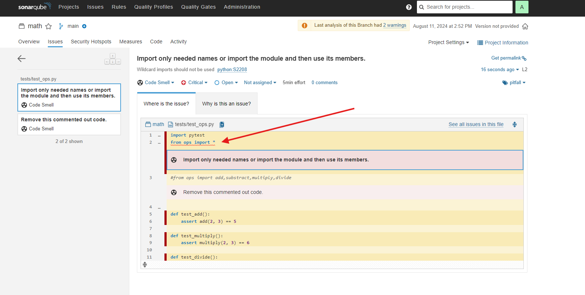

# Sonarqube
O Sonarqube é uma ferramenta utilizada para verificação de códigos.

## Arquitetura


## Pré-requisitos
* Docker

## Como destravar os pré-requisitos?

### Instalação do Docker
https://www.youtube.com/watch?v=pRFzDVn40rw&list=PLbPvnlmz6e_L_3Zw_fGtMcMY0eAOZnN-H

## Como baixar o projeto?
```
git clone https://github.com/wlcamargo/sonarqube
```

## Como rodar o Sonarqube?
Entre na pasta do projeto
```
cd sonarqube
```

Execute o comando para baixar imagens e rodar containers
```
sudo docker compose up -d
```

## Como acessar?
localhost:9077

---------------------------------
Credenciais no primeiro acesso:

login: admin     
password: admin

---------------------------------

## Warning
Comando para pegar o host no Linux (caso necessite)
```
ip a | grep etho
```

----------------------------

* Altere o endereço do host
* Altere o nome do projeto
* Altere o caminho do projeto que será testado
* Adicione o token
* Altere a linguagem se necessário, neste caso estou usando Python

----------------------------

## Comando para realizar o check
```
docker run --rm -e SONAR_HOST_URL="http://<Seu-Host>:9077" \ # Adicione o teu host
    -v "/home/wallace/docker/sonarqube:/usr/src" \ # Altera para a pasta de que deseja fazer o scan
    sonarsource/sonar-scanner-cli \
    -Dsonar.projectKey=gambiarra \ # Altere o nome do projeto
    -Dsonar.sources=. \
    -Dsonar.host.url=http://<Seu-Host>:9077 \ # Adicione o teu host
    -Dsonar.language=py \ # Altere a linguagem se necessário
    -Dsonar.login=<Seu-Token> #Adicione o Token
```

### Sobre o teste realizado

O teste vai conferir os códigos da pasta ```tests``` contida nesse projeto.

O código é bem simples e tem o objetivo de testar funções matemáticas com Python.

### Análise do resultado

No primeiro check recebemos um ```code smell``` por importar todas as funções e isso não é uma prática recomendada.

Código errado:
```
import pytest
from ops import *
```



No segundo check o teste passou, pois importamos somente as funções necessárias, conforme sugerido por ele.

Código certo:
```
import pytest
from ops import add,substract,multiply,divide
```


## Conclusão
Parabéns! Agora você já tem um verificador de códigos.

## Referências
https://www.youtube.com/watch?v=HSFHgti6nXg

https://www.sonarsource.com/products/sonarqube/?s_campaign=SQ-EMEA-South-South-Brand&s_content=SonarQube&s_term=sonarqube&s_category=Paid&s_source=Paid%20Search&s_origin=Google&cq_src=google_ads&cq_cmp=21283128645&cq_con=164767820560&cq_term=sonarqube&cq_med=&cq_plac=&cq_net=g&cq_pos=&cq_plt=gp&gad_source=1&gclid=Cj0KCQjwwuG1BhCnARIsAFWBUC1cQTl-vQmkkN6W2TMnlBV5b8pODbnvXNfUZ4VHrQpNbPopE3imepoaAlQoEALw_wcB


## Developer
| Desenvolvedor      | LinkedIn                                   | Email                        | Portfólio                              |
|--------------------|--------------------------------------------|------------------------------|----------------------------------------|
| Wallace Camargo    | [LinkedIn](https://www.linkedin.com/in/wallace-camargo-35b615171/) | wallacecpdg@gmail.com        | [Portfólio](https://wlcamargo.github.io/)   |